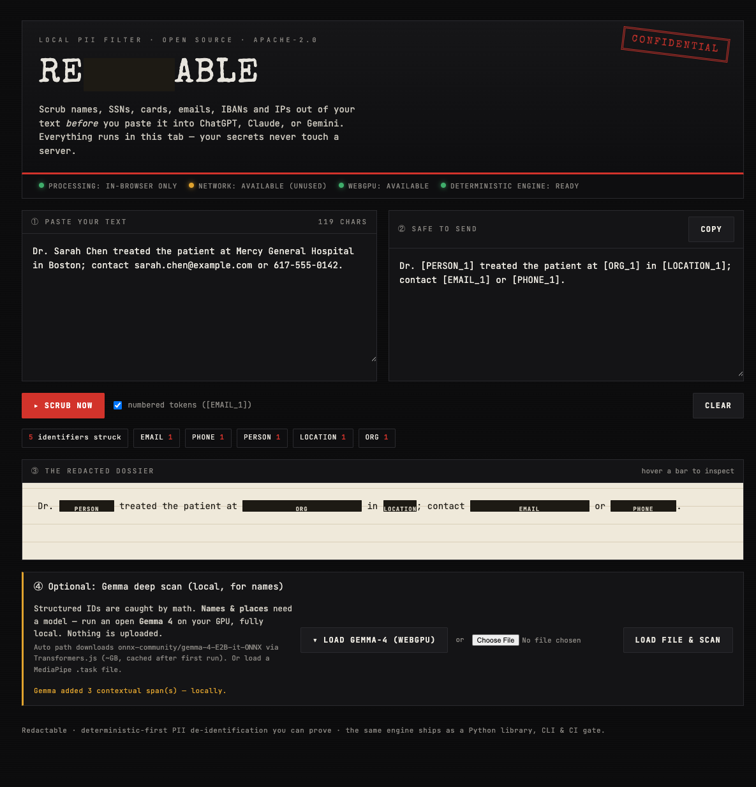

# Redactable — browser edition

**Scrub PII out of your text *before* you paste it into ChatGPT / Claude / Gemini.**
Everything runs in the tab — your text never leaves the browser.



## What it does

Same deterministic-first philosophy as the Python engine, ported to JavaScript:

- **Deterministic core** (`redactable.js`) — regex + checksums (Luhn / IBAN MOD-97 / ABA),
  plus IPv4/IPv6. **Zero dependencies, zero network, zero model** — runs instantly in any
  modern browser. Catches emails, phones (incl. international), SSNs (dashed *and* compact),
  cards, IBANs (compact *and* grouped), IPs, routing numbers, URLs.
- **Optional Gemma deep scan** (`gemma.js`) — contextual PII (names, places, orgs) that has
  no checksum. Runs an open **Gemma-4** locally on **WebGPU**, so the text still never leaves
  the tab. Two backends:
  - **Transformers.js** — auto-downloads `onnx-community/gemma-4-E2B-it-ONNX` from the HF Hub
    (the approach from [webml-community/Gemma-4-WebGPU](https://huggingface.co/spaces/webml-community/Gemma-4-WebGPU)).
  - **MediaPipe** — loads a local `.task`/`.litertlm` Gemma bundle you pick from disk.

The model is **never the recall-critical path** — deterministic math owns structured IDs
(where a miss is a breach); Gemma only *adds* soft contextual spans.

## Run it

```bash
# from the repo root
python3 -m http.server 8777 --directory web
# open http://localhost:8777/index.html
```

(A static server is needed because the page uses ES modules; `file://` blocks module imports.)

Type or paste text → **Scrub now** (instant, deterministic) → optionally **Load Gemma-4
(WebGPU)** to also catch names → **Copy** the safe text.

## Verified working (live browser test, 2026-06-02)

Run end-to-end in Chromium via Playwright on this machine:

| Check | Result |
|---|---|
| Deterministic scrub of 11 mixed PII formats | ✅ all correct (incl. compact SSN, IPv6, grouped IBAN, UK phone; MAC & clock-time correctly ignored) |
| WebGPU adapter | ✅ acquired (`apple metal-3`) |
| Transformers.js | ✅ v4.2.0 loaded from CDN |
| Gemma-4 download + WebGPU load + inference | ✅ ran fully in-browser |
| End-to-end with deep scan | ✅ `Dr. [PERSON_1] treated the patient at [ORG_1] in [LOCATION_1]; contact [EMAIL_1] or [PHONE_1].` |

> Real bug the live run caught: Gemma-4 emits *slightly malformed* JSON (a stray brace), so
> the first parser returned nothing. `spansFromModelJson` now recovers entities with a regex
> fallback — a fix that only a real run surfaces.

## Notes & limits

- In-browser Gemma needs **WebGPU** (most 2026 desktop browsers) and a **multi-GB model
  download** on first use (cached afterward). The deterministic core works everywhere with none
  of that.
- This is a **leakage-reduction helper, not a compliance guarantee** — same honest framing as
  the Python engine. Review before you send.
- Form factors (git hook, CLI, Chrome extension) are scaffolded in [`TODO.md`](TODO.md).
